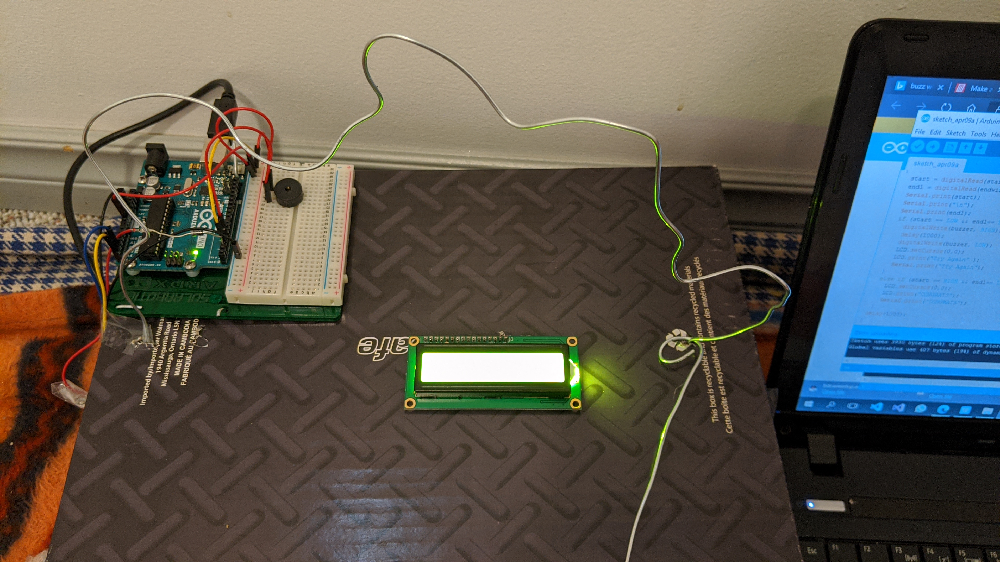
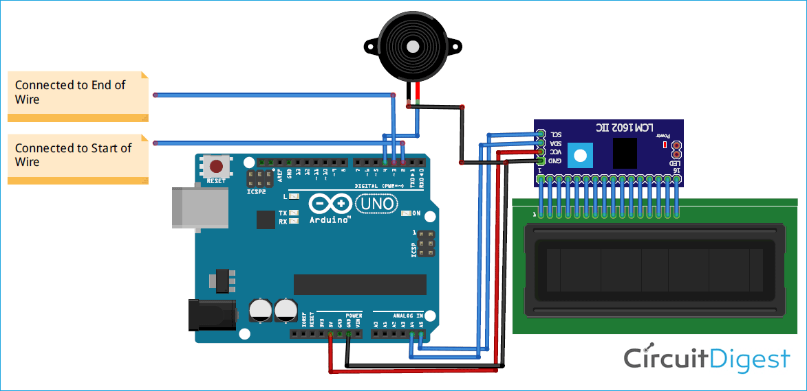

# Buze Wire Game with Arduino Uno

The following project is a Buzz Wire Game. It is made in order to combine the content I learn from my CS 207 course and to make something creative.
Its mainly a old game that uses connectivity and electric conductivity to test your ability to focus and move in a maze without mistakes. It’s easy to make, but hard to play without sounding the buzzer.
Its a popular project as its a well known way for having fun and a lot of creator have made the project. I made the project in similar way like other creators. 
The project is same as described in the proposal. There was up and down in the milestone which is further described in the milestone section. I was thinking to add some LED to make the project look more interesting but drop the idea as I was running out of time.
## Components Required
* [Arduino Uno](adruino-uno)
* [Aluminum Wire](aluminum-wire)
* [16x2 LCD](16x2-lcd)
* [I2C Module](i2c-module)
* [Breadboard](breadboard)
* [Buzzer](buzzer)
* [Diode](diode)
## Set Up

Bend the Aluminum wire in loops rounds and small drops following large climbs to increase the difficulty and fun. Use tapes on both end to provide a start/ end zone. Now you also need to make a loop controller.Twist a small piece of the coat hanger at one end to create a loop with a small metal handle. Make sure you file the cut edge, and then cover it with tape/foam if necessary. When this loop touches the course it will complete the circuit.


Take a wooden/cardboard base to make your wire stand on. Drill two hole on two side and make the wire stand on it. Add the LCD,Buzzer and Arduino wherever you want to. Done forgot to add the handle wire in buzz loop.
Make sure you add diode to the end of the first wire


Now to complete the circuit you need some wire to connect the parts. SCL and SDA pins of the I2C module are connected to A5 and A4 pins of Arduino while VCC and GND pin of the I2C module are connected to 5V and GND pin of Arduino. The positive rail of Buzzer is connected to digital pin 4 of Arduino and the negative rail is connected to GND. Cut an aluminum wire and bends it in Zig-Zag shape. Solder a diode at the one end of the wire. Then cut another wire to make a handle and bend one end into a loop. Connect the D2 & D3 pins of Arduino to both the ends of Zig-Zag wire and connect the handle wire to the GND pin of Arduino.
## Code
```
#include <LiquidCrystal_I2C.h>
LiquidCrystal_I2C LCD(0x27, 16, 2);
const int startwire  = 2;
const int endwire = 3;
const int buzzer = 4;
int start, endl;
void setup(void)
{
Serial.begin(9600);
pinMode(buzzer, OUTPUT);
pinMode(startwire, INPUT_PULLUP);
pinMode(startwire, INPUT_PULLUP);
}
void loop(void)
{  
start = digitalRead(startwire);
endl = digitalRead(endwire); 
Serial.print(start);
Serial.print("\n");
Serial.print(endl);  
if (start == LOW && endl== LOW ){
digitalWrite(buzzer, HIGH);
delay(1000); 
digitalWrite(buzzer, LOW); 
LCD.setCursor(0,0);
LCD.print("Try Again" );   
Serial.print("Try Again");        
}
else if (start == HIGH && endl== LOW){
LCD.setCursor(0,0);
LCD.print("CONGRATS");
Serial.print("CONGRATS");
}
delay(1000); 
}

```

## Team
* I did Eveything
## Credit
* Trevor Tomesh(For proect)
* Andre Santos(for pointing the errors in code)
